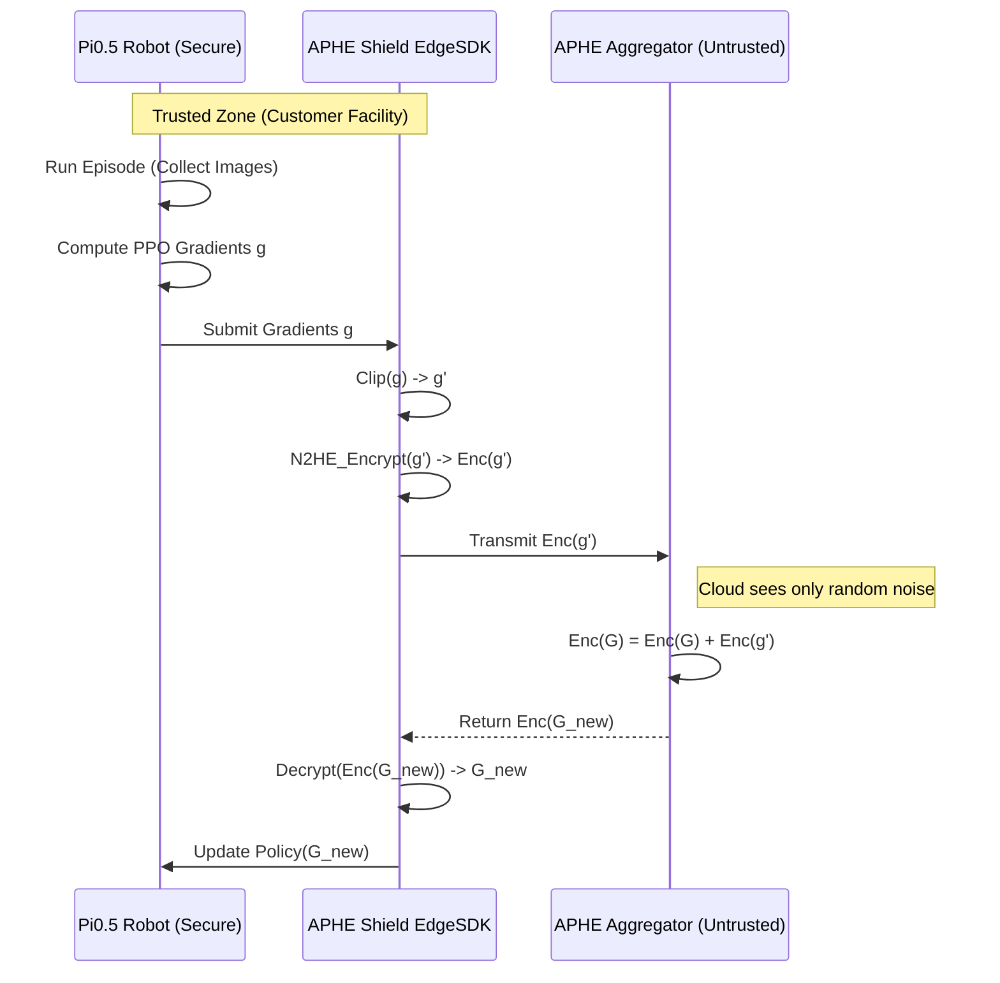

# Case Study: Fine-Tuning Pi0.5 VLA with Reinforcement Learning and APHE-Shield

This case study demonstrates how to securely fine-tune a **Pi0.5 VLA (Vision-Language-Action)** model using **Reinforcement Learning (RL)** on a fleet of robots, protecting proprietary facility data using APHE-Shield.

## Scenario
*   **Robot**: Humanoid Robot (e.g., Unitree H1 or similar) equipped with Pi0.5 VLA.
*   **Task**: "Precision Stacking" in a warehouse with proprietary layout.
*   **Constraint**: The warehouse layout and packing workflow are trade secrets. Video feeds cannot leave the facility.
*   **Goal**: Improve the VLA's success rate using on-policy RL (PPO) without exposing raw data.

---

## Step 1: Environment Setup & Prerequisites

Ensure the robot has the APHE-Shield Edge SDK installed and access to the Pi0.5 model weights.

```python
# Install SDK
# pip install aphe-shield[edge] torch numpy
```

### The Pi0.5 Wrapper
Since Pi0.5 might have a custom API, we define a lightweight wrapper to expose its gradient computation.

```python
import torch
import numpy as np
from typing import Dict, Any
from pi0_sdk import Pi0Model  # Hypothetical manufacturer SDK

class Pi05Wrapper:
    def __init__(self, key_path: str):
        self.model = Pi0Model.from_pretrained("pi0.5-base")
        self.optimizer = torch.optim.AdamW(self.model.parameters(), lr=1e-5)
        
    def get_gradient(self, trajectory: Any) -> Dict[str, np.ndarray]:
        """
        Compute gradients for a trajectory using policy gradient.
        """
        self.optimizer.zero_grad()
        
        # RL Loss Calculation (e.g., PPO)
        # pi0.5 takes (observation, instruction) -> action_distribution
        obs = trajectory['observations']
        actions = trajectory['actions']
        rewards = trajectory['rewards']
        
        loss = self.model.compute_ppo_loss(obs, actions, rewards)
        loss.backward()
        
        # Extract gradients as numpy dict
        grads = {}
        for name, param in self.model.named_parameters():
            if param.grad is not None:
                grads[name] = param.grad.cpu().numpy()
                
        return grads
        
    def apply_update(self, global_grads: Dict[str, np.ndarray]):
        """Apply aggregated gradients from APHE-Shield."""
        with torch.no_grad():
            for name, param in self.model.named_parameters():
                if name in global_grads:
                    # Apply update with learning rate involved or direct parameter update
                    # Here assuming global_grads are directly applicable deltas
                    grad_tensor = torch.from_numpy(global_grads[name]).to(param.device)
                    param.data -= 1e-5 * grad_tensor # Simple SGD step
```

---

## Step 2: APHE-Shield Integration

We use the `VLAAdapter` to bridge our custom Pi0.5 wrapper with the APHE-Shield encryption engine.

```python
from moai_shield import EdgeClient, VLAAdapter

# 1. Initialize the Pi0.5 Model
robot_policy = Pi05Wrapper(key_path="/etc/pi0/keys")

# 2. Create Adapter
# We map the wrapper's methods to what APHE expects
adapter = VLAAdapter.from_custom(
    model=robot_policy,
    gradient_fn=lambda m, d: m.get_gradient(d),
    apply_fn=lambda m, g: m.apply_update(g)
)

# 3. Initialize Encrypted Edge Client
# This handles the N2HE encryption, noise addition, and secure submission
client = EdgeClient(
    adapter=adapter,
    encryption_key_path="/secure/customer_keys/n2he_secret.pem",
    aggregation_endpoint="grpcs://aggregator.aphe-shield.com:443",
    security_level=128
)
```

---

## Step 3: The Privacy-Preserving RL Loop

This is the core training execution. Instead of aggregating gradients on a plain-text parameter server (standard RL), we run the standardized RL collection loop but route the updates through APHE-Shield.

```python
def run_rl_training_cycle(num_episodes=100):
    print("🚀 Starting Privacy-Preserving RL for Pi0.5")
    
    # RL Hyperparameters
    UPDATE_FREQUENCY = 10  # updates every 10 episodes
    trajectories = []

    for episode in range(num_episodes):
        # A. Collect Experience (Standard RL)
        # Robot interacts with the valid PHYSICAL environment
        # NO data leaves the robot here.
        traj = run_episode_on_robot(robot_policy.model)
        trajectories.append(traj)
        
        # B. Periodic Encrypted Update
        if (episode + 1) % UPDATE_FREQUENCY == 0:
            print(f"Encrypting and submitting update for batch {episode}...")
            
            # 1. Compute Gradients Locally
            # This happens in the robot's trusted compute base
            # 'batch' contains sensitive images of the facility
            batch = aggregate_trajectories(trajectories)
            
            # 2. Submit via APHE-Shield
            # - Gradients are Clipped (Differential Privacy)
            # - Gradients are N2HE Encrypted (Homomorphic Encryption)
            # - Encrypted blob is sent to Aggregator
            try:
                # This function handles the full pipeline
                client.submit_encrypted_update(batch)
                print("✅ Encrypted update submitted safely.")
            except Exception as e:
                print(f"❌ Update failed: {e}")
            
            # 3. Fetch Global Model
            # Retrieve the aggregated, encrypted global model update
            # Decrypt locally using the customer's private key
            updated_weights = client.get_latest_model()
            if updated_weights:
                robot_policy.apply_update(updated_weights)
                print("🔄 Robot policy updated with global knowledge.")
            
            # Reset buffer
            trajectories = []

# Helper mock for the case study
def run_episode_on_robot(model):
    return {"observations": np.random.randn(10, 3, 224, 224), "rewards": [1.0]*10, "actions": [0]*10}

def aggregate_trajectories(trajs):
    return trajs[0]  # Simplified
```

---

## Step 4: Verification

To ensure the system is working as intended:

1.  **Check Traffic**: Use `tcpdump` to verify that all outgoing traffic to `aggregator.aphe-shield.com` is high-entropy (encrypted). You should see no plaintext JSON or image data.
2.  **Verify Keys**: Ensure the `n2he_secret.pem` is present ONLY on the robot/local gateway and NEVER transmitted.
3.  **Monitor Dashboard**: Use the APHE-Shield Integrator Dashboard to track "Encrypted Updates Received" without seeing the actual updates.

## Architecture View



## Conclusion

By wrapping the Pi0.5 RL loop with APHE-Shield, the System Integrator enables the robot to learn from its specific environment (improving stacking efficiency) while mathematically guaranteeing that no video feeds or proprietary layouts are ever exposed to the cloud or third parties.
